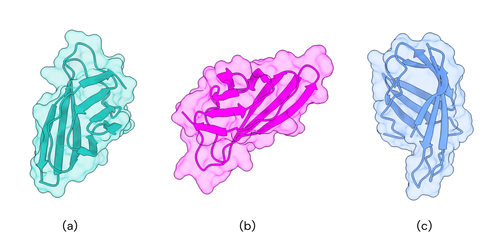

### Homo-oligomer analysis

---

Proteins with carbohydrate-binding modules (CBM) can not only be found as single units but also in more units or as part of larger multi-domain proteins. An example of this is a component of the Piromyces equi cellulase and hemicellulose complex NCP-1 [doi:10.1016/j.jmb.2003.12.081].  Separately, the protein has a weak interaction with its ligands, but its interaction with two modules of the protein changes the ligand specificity.

In light of the importance of understanding the thermodynamics basis for structural composition, the newest version of Alpha Fold was used [doi.org/10.1038/s41586-024-07487-w]. The model was used to optimize protein-protein interaction and test high-order oligomers. To effectively model the water filter system closer to reality, the first step was to predict the state of the proteins.

Although the optimized Barbie1-CBM (B1-CBM) protein oligomer state was unknown and needed to be understood, the spidroin protein that forms the nanofiber has already been explored in literature [doi.org/10.1038/nchembio.2269]. This study relies on the experimental formation of the nanofibers, exploring firstly the formation of dimers in neutral pHs followed by the formation of the fiber itself in acid environments (pH = 5). Therefore, the prediction of the oligomer state of the spidroin protein is not necessary.

The proposed CBM proteins to be evaluated in Alpha Pulldown are the BaCBM2 (Figure 1. a), B1-CBM (Figure 1. b), and 3NDY (Figure 1. c), which is a reference protein. Since this reference protein was resolved with more subunits, it can serve as a baseline for the prediction of the other proteins.

In the table below, the results from Alpha Fold for each protein were evaluated based on the predicted template modeling (pTM) and interface predicted template modeling (iPTM) score. Both of these measures evaluate the accuracy of the entire structure [doi.org/10.1002/prot.20264,doi.org/10.1093/bioinformatics/btq066].

About the *pTM* values:

🟩: If the value is above 0.5, it is possible to affirm the overall prediction for the complex may be similar to the actual structure;

🟨: Otherwise, if the pTM value is below 0.5, it might not be similar to the true structure, and it is likely wrong.

Concerning the *iPTM* values:

🟩: Values higher than 0.8 represent high confidence in prediction;

🟨: Values between 0.6 and 0.8 are a gray zone in which it is unlikely to assure if the prediction is right or wrong;

🟥: For values lower than 0.6, it is possible to ensure the prediction is wrong when compared to the actual structure.

| Subunits | BARBIE1 (pTM) | CBM2 (pTM) | 3NDY (pTM) | BARBIE1 (iPTM) | CBM2 (iPTM) | 3NDY (iPTM) |
|----------|----------------|------------|------------|----------------|-------------|-------------|
| 1        | 🟩 0.86       | 🟩 0.89    | 🟩 0.91    | -              | -           | -           |
| 2        | 🟨 0.48       | 🟩 0.50    | 🟩 0.51    | 🟥 0.09        | 🟥 0.10     | 🟥 0.09     |
| 3        | 🟨 0.44       | 🟨 0.40    | 🟨 0.39    | 🟥 0.21        | 🟥 0.12     | 🟥 0.14     |
| 4        | 🟨 0.32       | 🟨 0.35    | 🟨 0.33    | 🟥 0.12        | 🟥 0.16     | 🟥 0.12     |
| 5        | 🟨 0.25       | 🟨 0.28    | 🟨 0.30    | 🟥 0.10        | 🟥 0.12     | 🟥 0.13     |
| 6        | 🟨 0.25       | 🟨 0.28    | 🟨 0.30    | 🟥 0.09        | 🟥 0.13     | 🟥 0.12     |
| 7        | 🟨 0.25       | 🟨 0.26    | 🟨 0.26    | 🟥 0.13        | 🟥 0.14     | 🟥 0.18     |
| 8        | 🟨 0.20       | 🟨 0.23    | 🟨 0.22    | 🟥 0.13        | 🟥 0.14     | 🟥 0.14     |
| 9        | 🟨 0.21       | 🟨 0.22    | 🟨 0.23    | 🟥 0.14        | 🟥 0.13     | 🟥 0.18     |
| 10       | 🟨 0.21       | 🟨 0.22    | 🟨 0.24    | 🟥 0.13        | 🟥 0.14     | 🟥 0.17     |

Even though the 3NDY protein was initially resolved with more subunits, its prediction with a higher number of subunits was expected to be higher, which does not reflect the reality. This result can be explained by the fact that the iPTM measures the accuracy of the predicted relative positions of the subunits forming a protein-protein complex. It is also the reason why there is no value for a monomer protein.

Therefore, it is possible to affirm all three proteins analyzed are very not likely to form a protein-protein complex. Whereas it does not mean the carbohydrate-binding modules of different proteins can not interact between different units, which can be further explored in macromolecular resolution.
