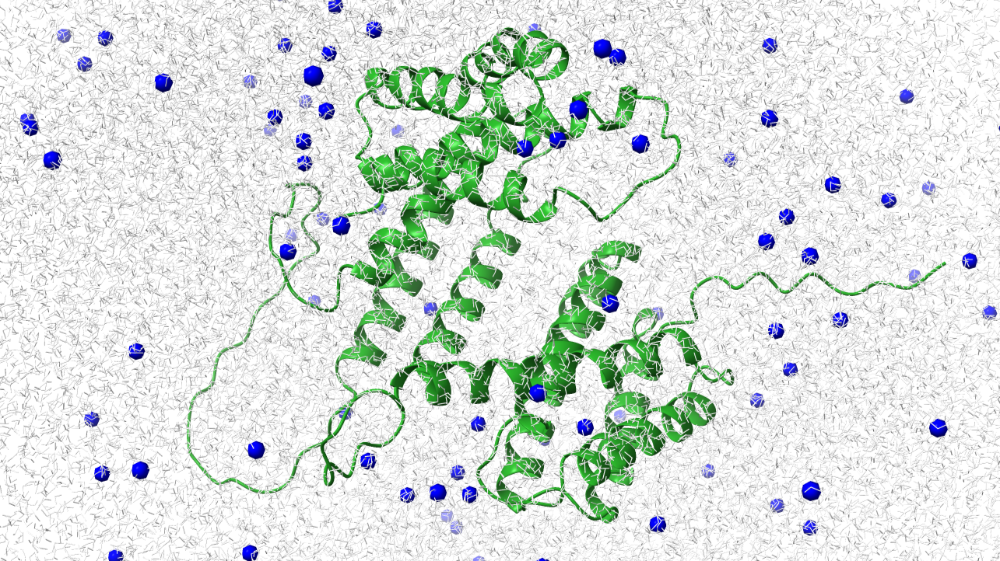

### Solution builder

---

Conditions for the molecular dynamic of Barbie1-CBM (B1-CBM):

- Salt in solution: NaCL 
- Salt concentration: 150 mM
- pH solution: 7.5
- Box dimension: 10 Å

Conditions for the molecular dynamic of Barbie1-CBM (B1-CBM):

- Salt in solution: NaCL 
- Salt concentration: 150 mM
- pH solution: 7.0
- Box dimension: 10 Å (?)

