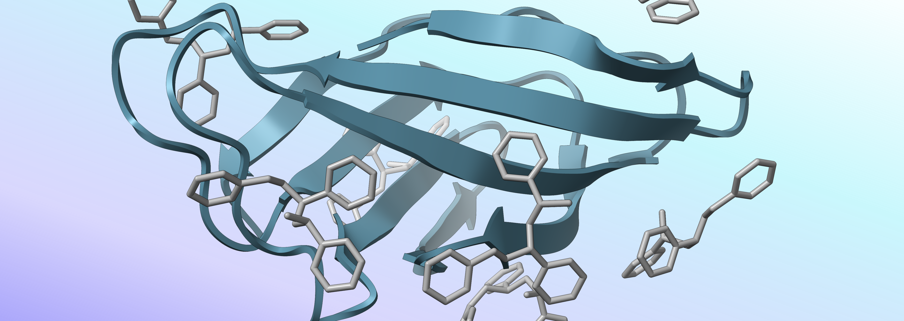

<!--  -->

<!-- 
Avaliação de um filtro biológico de microplásticos por meio de modelos termodinâmicos estatísticos integrados a dinâmica molecular
 -->

### Avaliação de um filtro biológico de microplásticos por meio de modelos termodinâmicos estatísticos integrados a dinâmica molecular

---

O presente repositório armazena o trabalho de conclusão de curso e desenvolvimento computacional do projeto B.A.R.B.I.E., participante da competição iGEM de 2024.

0. Molecules
1. Homo-oligomer
2. Molecular dynamic analysis
3. Experimental analysis
4. Protein corona
5. Thermodynamical model
6. Sensor
7. Filter viability

Realização por Pedro H. M. Zanineli, Pedro H. Sophia e colaboração de Gabriel X. Pereira, Marcos C. L. Pimentel
